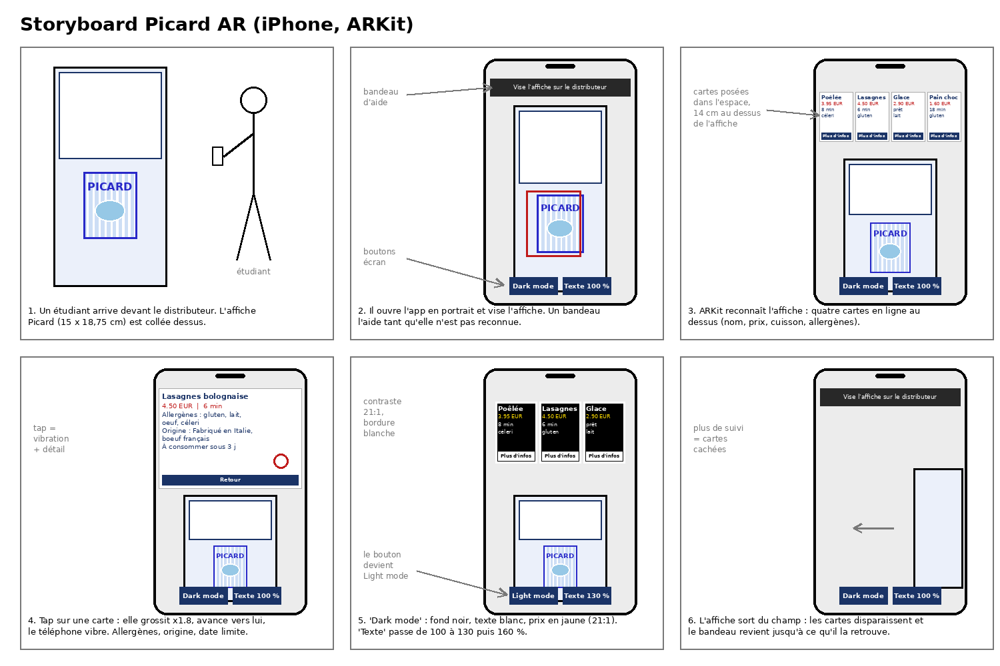

# 10 - Réalité augmentée Unity / IIMmersive Challenge

App iPhone en AR : on vise l'affiche collée sur un distributeur Picard et les produits du jour s'affichent en cartes au-dessus. Unity 6000.6.2f1, AR Foundation 6.6.2, ARKit.

## Installation

Unity 6000.6.2f1 avec le module iOS, Xcode, un iPhone. Le projet est dans `PicardAR/`.

1. `Picard > Build AR Scene` construit la scène, le prefab de carte, la bibliothèque d'images et le HUD.
2. `Picard > Apply iOS Player Settings`, puis XR Plug-in Management > iOS > Apple ARKit.
3. Build iOS, ouvrir dans Xcode, Run sur l'iPhone.
4. Imprimer `affiche_picard.jpg` (en couleur), ou afficher sur un écran (mat de preference)

## Choix

Choix de l'AR car personne ne se balade avec un casque méta sur la tete dans un picard (pour le moment). Donc AR sur téléphone plutôt que VR : le distributeur reste l'objet, l'app ajoute une couche d'info dessus, et le téléphone est déjà dans la poche. ARKit via AR Foundation parce que c'est natif Unity et gratuit.

## Expérience

Portrait, affiche cadrée à 40 cm ou 1 m, reconnue tout de suite par l'iphone. Quatre cartes (nom, prix, allergènes, cuisson) en ligne au-dessus de l'affiche. Un tap agrandit une carte avec le détail (allergènes en entier, origine, DLC) et fait vibrer le téléphone. Deux boutons : dark mode et taille du texte. Si l'affiche sort du champ les cartes disparaissent.

## Code

- `TrackedImagePanelSpawner` écoute `trackablesChanged` et instancie 4 `ProductPanel` (canvas world space avec un `BoxCollider` pour le tap). 
- `Editor/PicardSceneBuilder.cs` construit la scène par code. 
- `OrientationFix.cs` corrige la pose ARKit qui arrive en paysage sur iOS 27 avec Unity 6.6.

Contraste 12.3:1 en clair, 21:1 en dark mode.
Allergènes en toutes lettres. 
ODD 10 et 12 : lisibilité, origine et Date limite de consommation affichées.

Vidéo : https://youtu.be/f6wqBbixhuM

## Sources

- https://docs.unity3d.com/Packages/com.unity.xr.arfoundation@6.6/manual/project-setup/install-arfoundation.html : compatible Unity 6
- https://docs.unity3d.com/Packages/com.unity.xr.arfoundation@6.6/changelog/CHANGELOG.html : trackablesChanged
- https://docs.unity3d.com/Packages/com.unity.xr.arkit@6.6/manual/arkit-image-tracking.html : taille physique obligatoire
- https://developer.apple.com/documentation/arkit/detecting-images-in-an-ar-experience : marker plat et mat
- https://ar-js-org.github.io/AR.js-Docs/image-tracking/ : AR.js
- https://accessibilite.numerique.gouv.fr/ : RGAA
- https://www.w3.org/WAI/WCAG21/quickref/ : ratios
