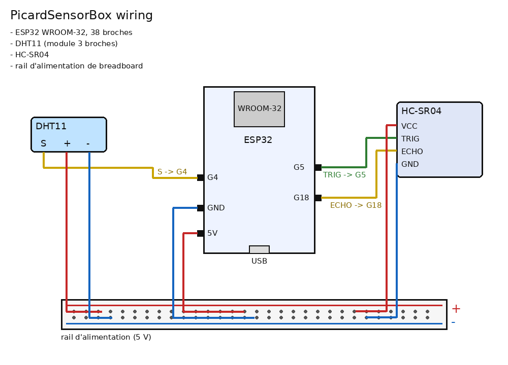
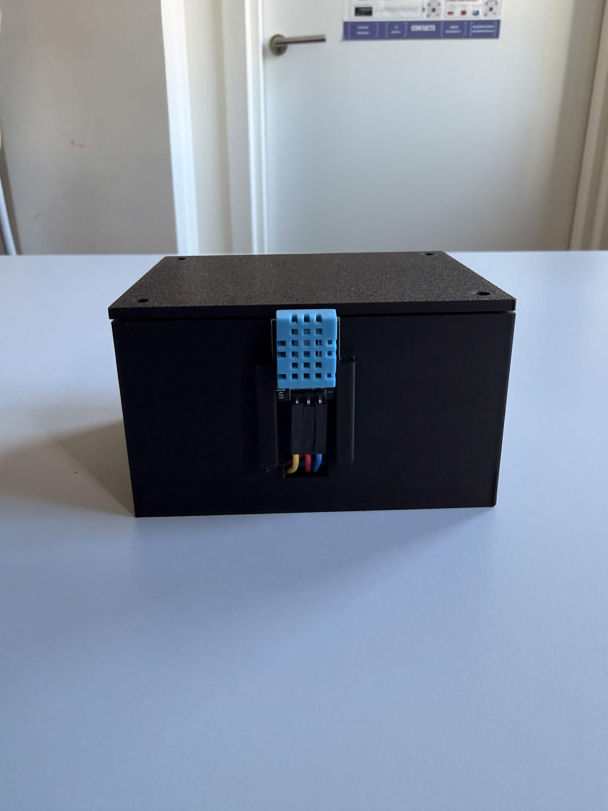

# 18 - Devlab - Veille et Expertise technique

Un ESP32 qui surveille un distributeur Picard (température, humidité, porte) et envoie ses mesures en Wi-Fi à un serveur Node avec dashboard. Boîtier modélisé sur Fusion 360 et imprimé en 3D.

## Installation

Firmware (PlatformIO) :

1. Copier `firmware/src/config.h.example` en `config.h`, renseigner le SSID, le mot de passe et l'endpoint du serveur PC.
2. Ouvrir `firmware/` dans PlatformIO, Upload.

Serveur :

```
cd server
npm install
npm start
```

Dashboard sur http://localhost:3000, l'ESP32 poste sur `/api/readings` toutes les 2 s.

Le modèle Fusion est dans `fusion/` (f3d et 3mf), les photos du montage dans `docs/`.

## Choix

Je comptais partir sur un DS18B20 étanche (-55 à +125 °C, ±0,5 °C, sonde inox à mettre dans le froid) et un ILS pour la porte. Par manque de matériel et de temps pour les commander, j'ai pris un DHT11 (0 à 50 °C, ±2 °C, il mesure l'air autour du boîtier) et un HC-SR04 (2 à 400 cm). Le HC-SR04 vise la porte : au delà de 15 cm elle est ouverte, médiane de 3 mesures pour éviter les false readings, sans écho l'état ne change pas.

Les deux capteurs sont alimentés par le rail 5 V de la breadboard, tiré de la broche 5V de l'ESP32. L'écho du HC-SR04 sort en 5 V sur une entrée 3,3 V, ça passe sur le prototype, un pont diviseur 1 k / 2 k serait à prévoir pour une version finale.



| Broche | Vers |
|---|---|
| 5V | rail + |
| GND | rail - |
| G4 | DHT11 S |
| G5 | HC-SR04 TRIG |
| G18 | HC-SR04 ECHO |

JSON écrit à la main dans le firmware, 7 champs. Si le POST échoue la mesure part dans un buffer de 40 entrées, vidé au retour du réseau. Le serveur garde tout dans `readings.jsonl` et pousse chaque mesure au dashboard en SSE.

Boîtier 90 x 66 x 50 mm, parois 2 mm, couvercle vissé sur 4 plots (M3 x 8 autotaraudeuses). L'ESP32 est sur 4 plots d'angle avec un pion dans chaque trou de fixation, à 28 mm du fond pour laisser la place aux cosses, et 4 contre-plots du couvercle le plaquent. L'USB affleure la paroi. Le HC-SR04 est debout derrière la paroi avant, tenu par deux barres rainurées, les yeux passent dans deux trous. Le DHT11 est à l'extérieur dans deux rainures, ses fils rentrent par un trou en dessous. Le rail de la breadboard se cale dans un cadre au fond.



Vidéo : [lien à ajouter]

## Sources

- https://www.analog.com/media/en/technical-documentation/data-sheets/ds18b20.pdf : fiche DS18B20
- https://www.mouser.com/datasheet/2/758/DHT11-Technical-Data-Sheet-Translated-Version-1143054.pdf : datasheet DHT11
- https://www.mouser.com/datasheet/2/813/HCSR04-1022824.pdf : datasheet HC-SR04
- https://randomnerdtutorials.com/esp32-hc-sr04-ultrasonic-arduino/ : HC-SR04 sur ESP32
- https://docs.platformio.org/en/latest/boards/espressif32/esp32dev.html : carte esp32dev
